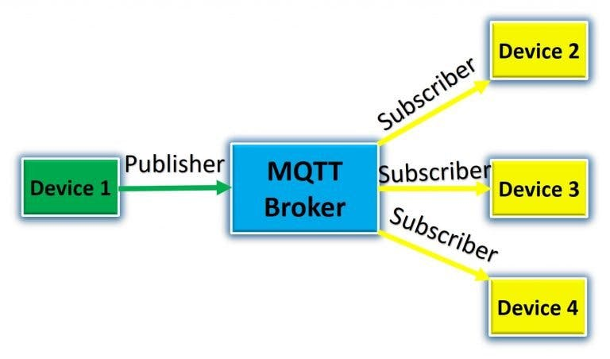
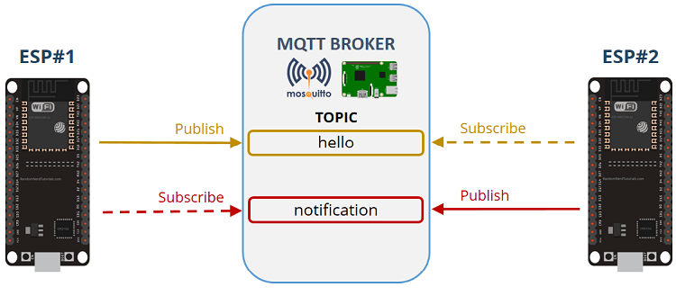

# Installer et exécuter MQTT Broker sur Raspberry Pi

## Histoire
Dans le monde en évolution rapide de l'IoT, il n'existe pas de norme universelle. Mais au cours des dernières années, MQTT a commencé à s'imposer comme le protocole de messagerie de facto. Dans ce didacticiel, vous apprendrez à configurer un serveur de messagerie MQTT en quelques minutes à l'aide d'un Raspberry Pi.


### Qu'est-ce que MQTT?

MQTT signifie Message Queuing Telemetry Transport, qui est un nom assez complexe. En termes simples, il s'agit d'un protocole très simple qui nous permet d'envoyer et de recevoir des messages sur un réseau vers n'importe lequel des appareils.

Il s'agit d'un protocole de communication de publication / abonnement et son utilisation est assez flexible. La section suivante traite des courtiers, éditeurs et abonnés MQTT.

### Courtiers, éditeurs et abonnés MQTT   `(Brokers, Publishers et Subscribers)`

Même si ces termes semblent effrayants, c'est une explication très simple. En termes de terminologie client-serveur, voici comment les expliquer:

Le courtier MQTT est le serveur.
Les abonnés et éditeurs MQTT sont les clients.
Le courtier MQTT dans ce tutoriel sera notre raspberry pi. Le rôle du courtier est de recevoir tous les messages des éditeurs (c'est-à-dire les clients qui publient sur ce serveur) et d'envoyer des messages particuliers aux abonnés (c'est-à-dire les appareils qui ont choisi de visualiser les données de capteurs publiées). L'image ci-dessous explique le concept dont nous venons de parler.



Mais une autre question se pose maintenant. Comment le courtier sait-il où et quel message publier ou envoyer à quel appareil. Ceci est fait en utilisant le concept de sujets et de messages. La section suivante les expliquera en détail.

### Sujets et messages MQTT

Il n'y a pas d'adresse ou d'identifiant de périphérique client dans MQTT, ce qui facilite la création d'un réseau ad hoc extensible. La seule chose que tous les clients doivent savoir est l'adresse du serveur.

Alors, comment les messages sont-ils acheminés entre les clients? La solution pour cela est les sujets et les messages.

### Éditeurs (Pblishers)
Les éditeurs envoient des messages à un sujet particulier, qui sont équivalents à des canaux. Un sujet peut également avoir des sous-sujets. Par exemple, dans une application où vous envoyez les données de température à partir d'un capteur connecté à votre réfrigérateur, le sujet ressemblera à ceci:

    `Cuisine/Réfrigérateur/`

Le sujet principal est la cuisine et l'appareil est le sous-sujet. Le message sera "Température: 14" sur le sujet donné.

### Les abonnés (Subscribers)
Les abonnés écoutent le sujet. Donc, si l'abonné écoute le sujet Kitchen, il aura accès à tous les sous-sujets qui font partie de ce sujet.

### Courtier (Broker)
Le Broker gère tous ces sujets et agit comme un connecteur intermédiaire. Il aide l'éditeur à publier ses messages sur un sujet et l'abonné à écouter le sujet donné. La seule exigence est qu'ils doivent être sur le même réseau si le courtier s'exécute localement.

C'est tout ce que vous devez savoir sur MQTT pour poursuivre ce didacticiel. Maintenant, nous allons apprendre ce qui suit:

## Hébergement d'un courtier Raspberry Pi MQTT
La seule exigence est un Raspberry Pi avec la dernière version de Raspbian Buster installée. 

Ouvrez un Terminal et suivez les instructions.

### Installez le courtier mosquitto MQTT

mosquitto est un courtier MQTT populaire qui est bien pris en charge sur les plates-formes Linux basées sur Debian telles que Raspbian. Il est facile à installer avec apt:

`sudo apt install mosquitto mosquitto-clients`

Vous n'avez pas strictement besoin du package mosquitto-clients pour exécuter le courtier, mais son installation vous permet d'exécuter le code client MQTT localement, ce qui est idéal pour les tests.

Cela signifie également que vous pouvez utiliser le Raspberry Pi en tant que client MQTT approprié ainsi qu'en tant que courtier. Cela signifie que vous pouvez, par exemple, ajouter une interface utilisateur pour contrôler d'autres clients MQTT autour de votre maison directement à partir du Raspberry Pi.

### Activez le courtier mosquitto

Activez le courtier et autorisez-le à démarrer automatiquement après le redémarrage à l'aide de la commande suivante: -

`sudo systemctl enable mosquitto`

Le courtier devrait maintenant être en cours d'exécution. Vous pouvez confirmer en vérifiant l'état du service systemd: 

`sudo systemctl status mosquitto`

## Publier / S'abonner à un sujet localement et à distance


### Test de la rubrique MQTT localement

Dans cette section, nous allons tester si notre serveur est actif en utilisant les terminaux Raspberry Pi pour tester. Suivez les étapes ci-dessous pour ce faire.

Testez Mosquitto en créant deux nouvelles instances du terminal. Dans un terminal, entrez ce qui suit:

`mosquitto_sub -v -t test / message`

Dans l'autre nouveau terminal, entrez:

`mosquitto_pub -t test / message -m 'Bonjour tout le monde!'`

Après avoir appuyé sur Entrée sur votre deuxième terminal, vous devriez voir le message "test / message Hello World!" sur le premier terminal.

# MicroPython - Premiers pas avec MQTT sur ESP32 / ESP8266


Dans ce didacticiel, nous allons vous montrer comment utiliser MQTT pour échanger des données entre deux cartes ESP32 / ESP8266 à l'aide du micrologiciel MicroPython. À titre d'exemple, nous échangerons des messages texte simples entre deux cartes ESP. L'idée est d'utiliser les concepts appris ici pour échanger des lectures de capteur ou des commandes.

## Project Overview
Here’s a high-level overview of the project we’ll build:



- ESP # 1 publie des messages sur le sujet Hello. Il publie un message «Hello» suivi d'un compteur (Hello 1, Hello 2, Hello 3,…). Il publie un nouveau message toutes les 5 secondes.

- ESP # 1 est abonné au sujet de notification pour recevoir des notifications de la carte ESP # 2.
- ESP # 2 est abonné au sujet Hello. ESP # 1 publie dans ce sujet. Par conséquent, ESP # 2 reçoit des messages ESP # 1.
- Lorsque ESP # 2 reçoit les messages, il envoie un message disant «reçu». Ce message est publié sur le sujet de notification. ESP # 1 est abonné à ce sujet, il reçoit donc le message.

## Préparation de l'ESP # 1

- Il est abonné au sujet de notification
- Il publie sur le sujet bonjour

### Importation de la bibliothèque umqttsimple
Pour utiliser MQTT avec ESP32 / ESP8266 et MicroPython, vous devez installer la bibliothèque umqttsimple.

1. Créez un nouveau fichier.

2. Copiez-y le code de la bibliothèque umqttsimple. Vous pouvez accéder au code de la bibliothèque umqttsimple dans le lien suivant:

    `https://raw.githubusercontent.com/RuiSantosdotme/ESP-MicroPython/master/code/MQTT/umqttsimple.py`
3. Enregistrez le fichier sous «umqttsimple.py».
4. Copiez le fichier dans le root de l'ESP

### boot.py
Ouvrez le fichier boot.py et copiez le code suivant dans ESP # 1

```python
# Complete project details at https://RandomNerdTutorials.com

import time
from umqttsimple import MQTTClient
import ubinascii
import machine
import micropython
import network
import esp
esp.osdebug(None)
import gc
gc.collect()

ssid = 'REPLACE_WITH_YOUR_SSID'
password = 'REPLACE_WITH_YOUR_PASSWORD'
mqtt_server = 'REPLACE_WITH_YOUR_MQTT_BROKER_IP'
#EXAMPLE IP ADDRESS
#mqtt_server = '192.168.1.144'
client_id = ubinascii.hexlify(machine.unique_id())
topic_sub = b'notification'
topic_pub = b'hello'

last_message = 0
message_interval = 5
counter = 0

station = network.WLAN(network.STA_IF)

station.active(True)
station.connect(ssid, password)

while station.isconnected() == False:
  pass

print('Connection successful')
print(station.ifconfig())
```

## main.py
Dans le fichier main.py, nous allons écrire le code pour publier et recevoir les messages. Copiez le code suivant dans votre fichier main.py.

```python
# Complete project details at https://RandomNerdTutorials.com

def sub_cb(topic, msg):
  print((topic, msg))
  if topic == b'notification' and msg == b'received':
    print('ESP received hello message')

def connect_and_subscribe():
  global client_id, mqtt_server, topic_sub
  client = MQTTClient(client_id, mqtt_server)
  client.set_callback(sub_cb)
  client.connect()
  client.subscribe(topic_sub)
  print('Connected to %s MQTT broker, subscribed to %s topic' % (mqtt_server, topic_sub))
  return client

def restart_and_reconnect():
  print('Failed to connect to MQTT broker. Reconnecting...')
  time.sleep(10)
  machine.reset()

try:
  client = connect_and_subscribe()
except OSError as e:
  restart_and_reconnect()

while True:
  try:
    client.check_msg()
    if (time.time() - last_message) > message_interval:
      msg = b'Hello #%d' % counter
      client.publish(topic_pub, msg)
      last_message = time.time()
      counter += 1
  except OSError as e:
    restart_and_reconnect()
```
C’est tout pour ESP # 1. N'oubliez pas que vous devez télécharger tous les fichiers suivants pour que le projet fonctionne (vous devez télécharger les fichiers dans l'ordre):

1. umqttsimple.py;
2. boot.py;
3. main.py.

Après avoir téléchargé tous les fichiers, vous devriez recevoir des messages de réussite sur: l'établissement d'une connexion réseau; se connecter au courtier; et souscrire au sujet.
